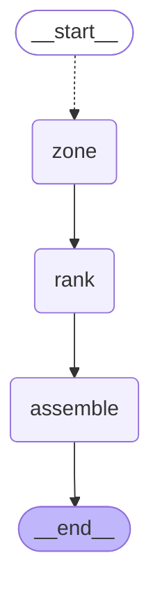
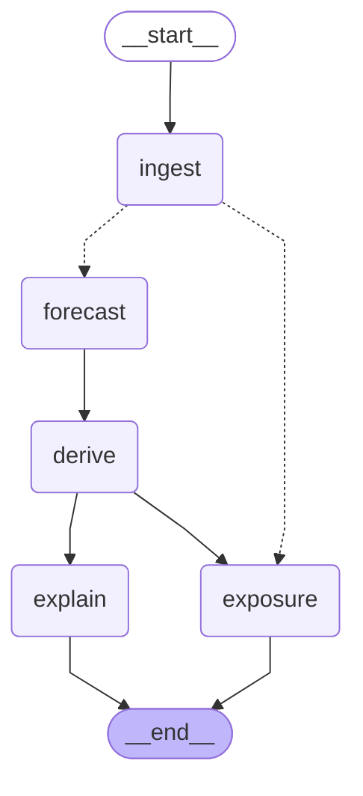

# Orchestration: how the agents connect

One tick (one issue time, every zone) is a single LangGraph workflow in `app/pipeline.py`. Replay, the REST API and the tests all
call it (`orchestrator.run_tick`), so there is one code path. `tests/reference_tick.py` keeps the old plain loop, and
`tests/test_pipeline.py` proves the graph returns identical payloads (it also did on 14 real ticks of 109 zones before the switch).

## Tick graph (zones fan out in parallel, then rank across zones)

## Zone subgraph (the agent chain, one zone)

* **ingestion** -> FeatureVector (only rows with `availability_ts <= issue_ts`). No usable gauge: the zone stops here and is reported as
  *insufficient data*, never low risk.
* **forecasting** -> DepthTrajectory (LightGBM quantiles, persistence fallback).
* **risk+peak** -> RiskOutput: probability, severity, onset from the trajectory, peak window replaced by the dedicated peak model.
* **explainability** and **exposure** run in parallel after risk.
* **rank** (cross-zone weighted sum) and **assemble** (alert text, `ZonePayload`) need every zone, so they come after the fan-in.

## Guarantees

| Property | How |
|---|---|
| Deterministic | zone results arrive in any order and are re-sorted into snapshot order before ranking |
| Failure isolation | an agent exception turns that zone into *insufficient data* (`rank_reason` says the forecast failed) and is listed in `TickResult.errors`; the tick completes |
| Observable | every node is a named LangChain `Runnable`; `trace` holds per-agent milliseconds; `GET /api/pipeline` returns the summary and this diagram |
| Streamable | `astream_tick` yields `zone` events as zones finish, then `ranked`, then `done`; `GET /api/tick/stream` is the SSE form |
| Bounded parallelism | `MAX_PARALLEL_ZONES = 4` (work is CPU-bound; more threads only add contention) |

## Cost (event 5, 109 zones, 80 forecast, laptop CPU): about 1.2 to 1.5 s per tick

Mean per call: forecasting 102 ms, risk+peak 133 ms, ingestion 1.1 ms, exposure 0.2 ms, explainability 0.04 ms (timings include thread
waits). Ticks are memoised by the replay engine, so scrubbing re-reads. Batching the LightGBM predictions across zones would be the
next speed-up if live ticks need to be faster.
